# Spark Broadcast Bot: A Multi-topic Cisco Spark Notification Bot 

Inspired by [BotKit samples for Cisco Spark](https://github.com/CiscoDevNet/botkit-ciscospark-samples) by Stève Sfartz <mailto:stsfartz@cisco.com>


## Instructions for deployment to Heroku

1. Click the **Deploy to Heroku** button below and choose a name for your app. Heroku will tell you right away if it's a valid name or not. Leave this page open because you will come back soon to complete the process.

2. Create a Bot Account from the ['Spark for developers' bot creation page](https://developer.ciscospark.com/add-bot.html). 
    - Choose a display name, a valid username and an icon for your bot. 
    - Press the **Add Bot** button and wait for your bot to be created. 
    - Copy your bot's **Access Token**.

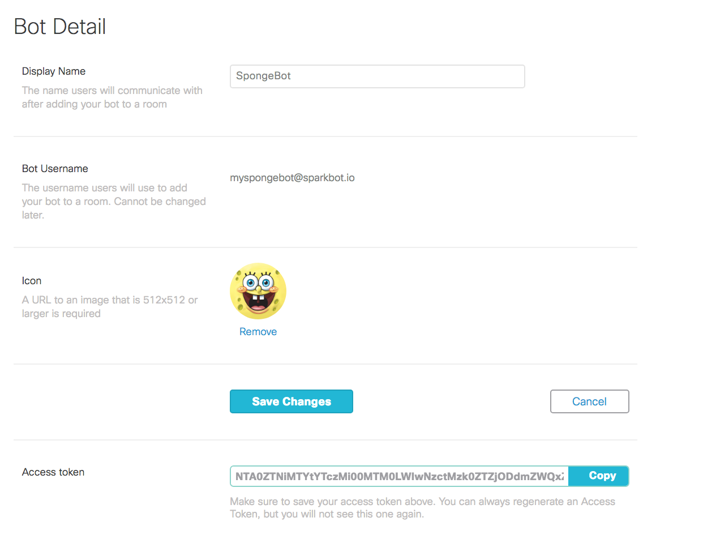

3. Create an Integration from the ['Spark for developers' integration creation page](https://developer.ciscospark.com/add-integration.html). 
    - Choose a name, a description, a support email and an icon for your integration. 
    - In the **Redirect URI(s)** box write `https://{app-name}.herokuapp.com`, where `{app-name}` is the name you chose for your Heroku app in step 1.
    - In the **Scopes** section, select `spark:people_read`.
    - Press the **Add Integration** button and wait for your bot to be created.

    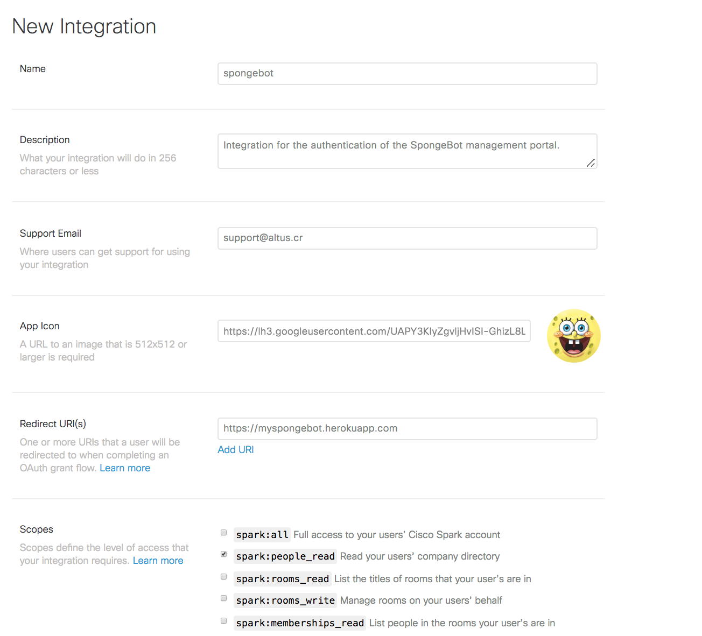

    - Copy the **Client ID**
    - Copy the **Client Secret**
    - Copy the **OAuth Authorization URL**

     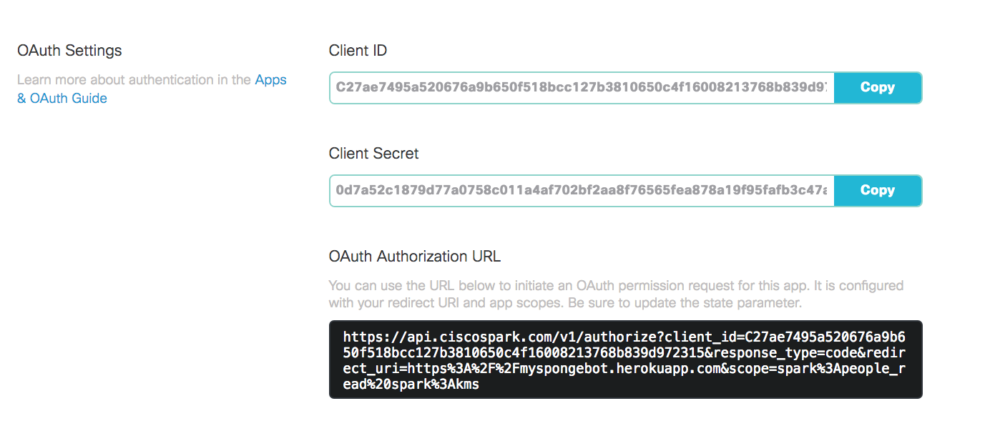

4. Go back to Heroku and scroll down until you reach the **Config Variables** section. Fill them according to the following instructions:
    - **PUBLIC_URL**: Write here `https://{app-name}.herokuapp.com` where `{app-name}` is the name of your Heroku app.
    - **SPARK_TOKEN**: Write here the token you got when you created your Spark bot.
    - **ALLOWED_DOMAIN**: Write here the domain that's authorized to send messages to your bot. Write in the format `@mydomain.com`.
    - **ALLOWED_ADMIN**: Write here the Spark username of the person authorized to manage the web application.
    - **SECRET**: Write here any secret phrase. This is used to validate both Spark's messages to the bot and to generate the authentication tokens used by the app backend.
    - **CLIENT_ID**: Write here the client id you got when creating the integration.
    - **CLIENT_SECRET**: Write here the client secret you got when creating the integration.
    - **REDIRECT_URI**: Write the URI you specified when creating the integration. It's `https://{app-name}.herokuapp.com` where `{app-name}` is the name of your Heroku app.
    - **OAUTH_URL**: Write the **OAuth Authorization URL** you got when creating the integration.
    - Click **Deploy app**

    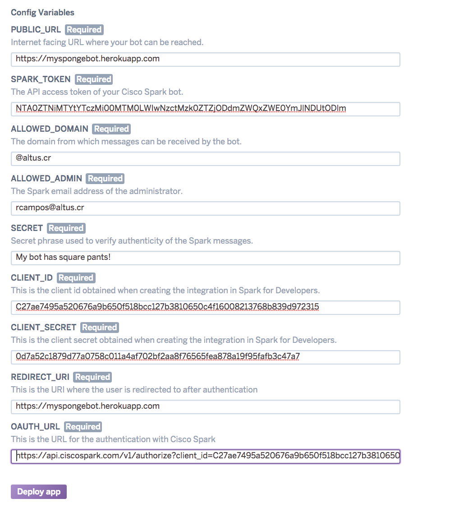

    Your application will now be created, configured, built and deployed to Heroku. 

    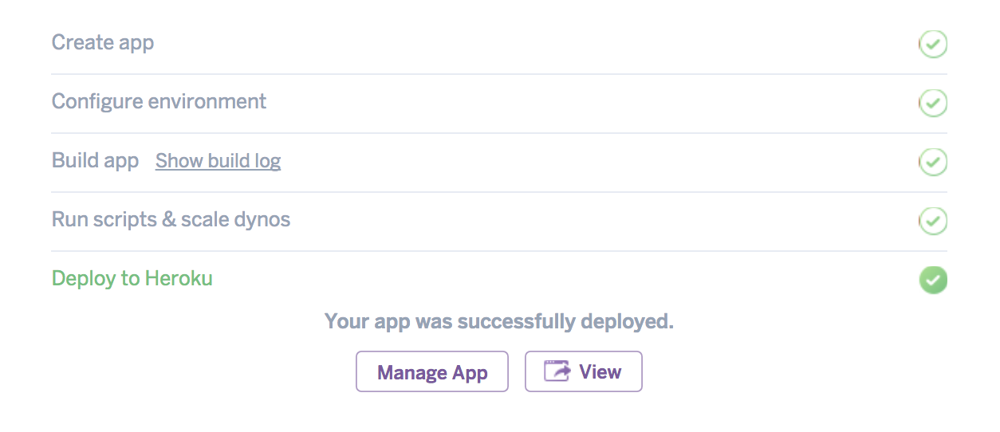

    After the process is done, your bot should be up and running and the administrator specified in the **ALLOWED_ADMIN** config variable should now be able to log into the management app at `https://{app-name}.herokuapp.com`.

[](https://heroku.com/deploy)


## Management app

Log into the management app at `https://{app-name}.herokuapp.com` by clicking **Login with Spark**.

    

    - You will be redirected to the Cisco Spark login page where you can input your credentials.

    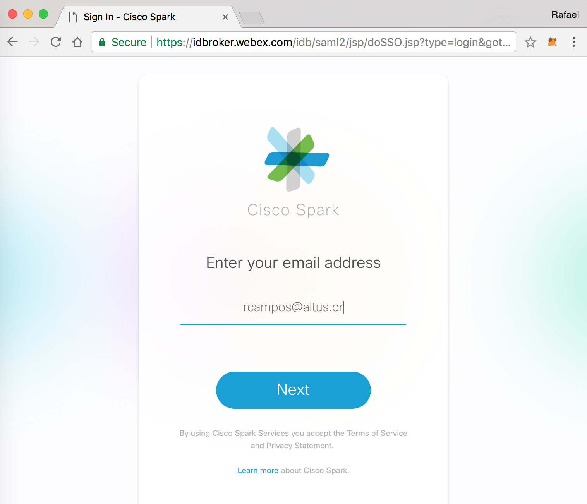
    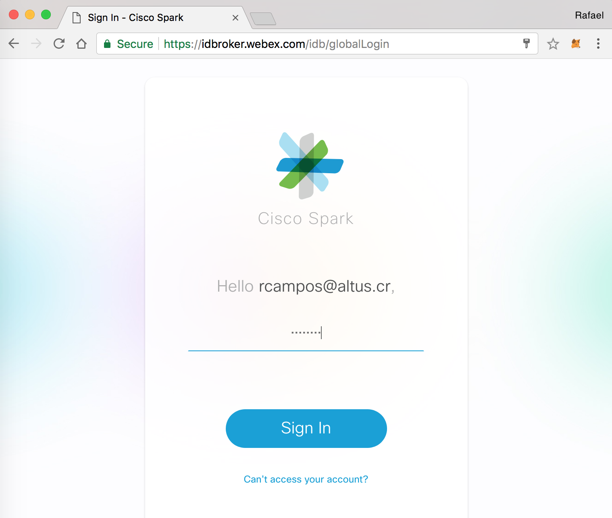

    - You will be asked if you want to allow the app to read your company directory and  encrypt and decrypt messages. Click **Accept**.

    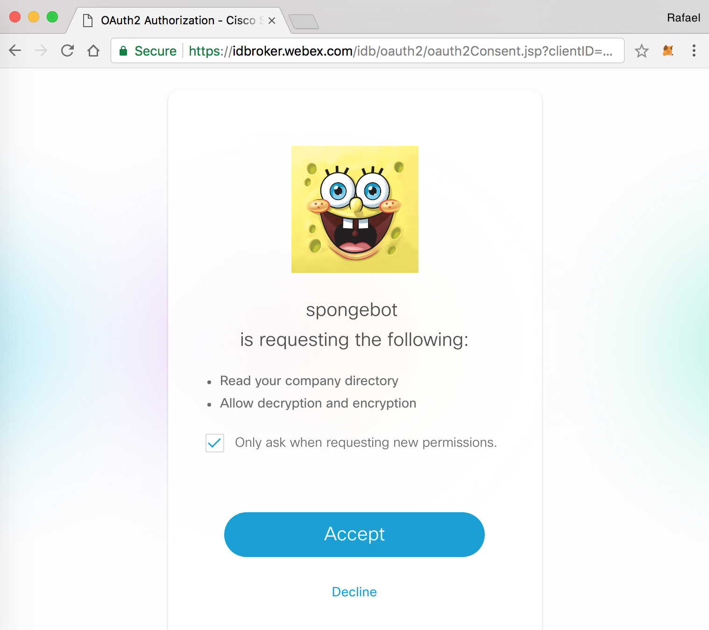

    - You should be redirected back to the app, where you now can manage your notification bot.

    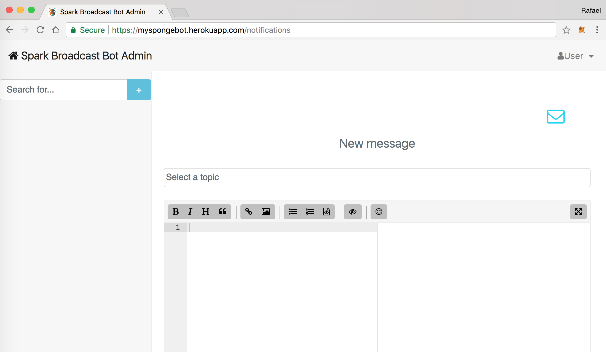

# TODO: instructions for using the web app


## Interacting with the bot

Add your bot to Cisco Spark.

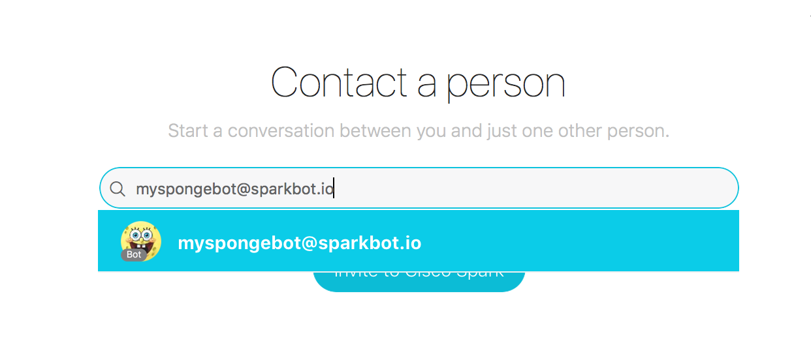

Say `help` to the bot to see all the commands it understands.

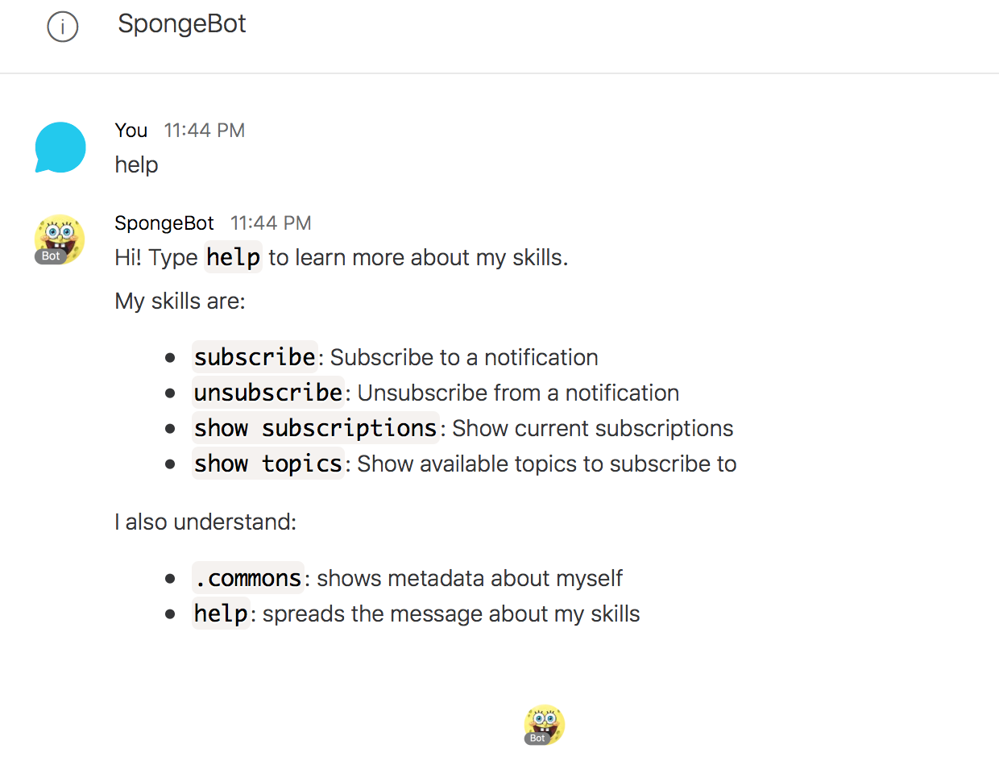

The notifications module allows you to subscribe to specific topics offered by your organization.

You can subscribe to a notification by telling the bot:

```
subscribe
```
or, for short:
```
sub
```
The bot will then ask you what topic you want to subscribe to. 

### Unsubscribing from a notification

You can subscribe to a notification by telling the bot:

```
unsubscribe
```
or, for short:
```
unsub
```

The bot will then ask you what topic you want to unsubscribe from. 

### Showing your current subscriptions

You can ask the bot for a list of your current subscriptions:

```
show subscriptions
```
or, for short:
```
show sub
```

# TODO: instructions for using the bot

